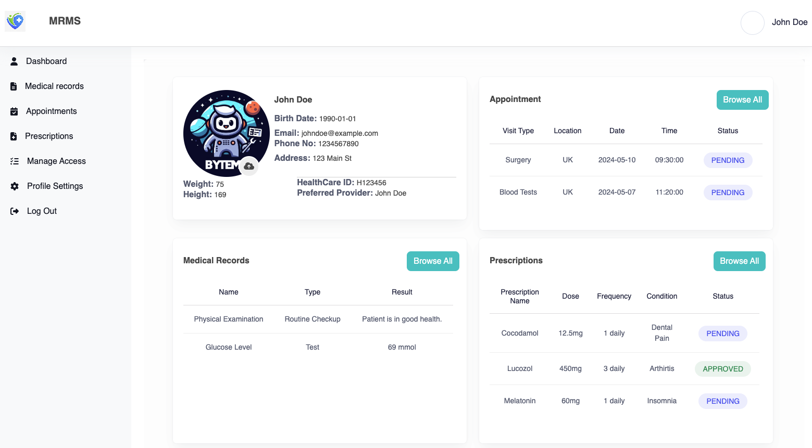

# MRMSAPI
Medical Records Management System

## Overview
This is a web-based healthcare system designed to streamline the management of patient medical records. The system allows patients to schedule appointments, view their medical history, and communicate with healthcare providers. Healthcare providers can manage appointments, prescriptions, and medical records for their patientss.

## Features
- **Appointment Management:** Patients can request appointments. Healthcare providers can view and manage appointments for their patients.
- **Prescription Management:** Healthcare providers can create, update, view and cancel prescriptions for their patients.
- **Medical Record Management:** Patients can view their medical history, including past appointments, prescriptions, and medical procedures.
- **Access Requests: Healthcare** providers can request access to medical records. Patients can approve or deny access requests.

## Technologies Used
- **Frontend:** Javascript, Vite, React.js, Material-UI, Tailwind
- **Backend:** Spring Boot, Java, MySQL
- **Authentication and Authorization:** Spring Security
- **Data Access:** Spring Data JPA
- **API Integration:** Axios
- 
## Deployed Server
- **URL:**

## Local Setup
1. Clone the repository: **git clone <repository-url>**
2. Navigate to the project directory: **cd MRMSAPI**
3. Install dependencies:
- Frontend: **cd AppMRMS && npm install**
- Backend: **./mvnw install**
4. Configure database connection in **application.properties** file.
5. Run the backend server: **./mvnw spring-boot:run**
6. Run the frontend server: **cd AppMRMS && npm start**

## Using it
1. Register as a patient or healthcare provider from **/signup**
2. Log in to access the system from **/signin**
3. From the landing page, use the naivgation bar links to access other pages and use the application

